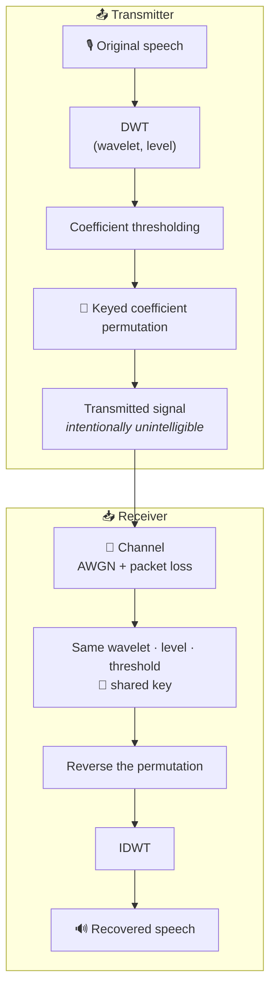

<div align="center">

# 🛰️ Wavelet Voice Lab

### Wavelet-Domain Robust Voice Communication Simulator

**DWT → thresholding → keyed coefficient scrambling → noisy channel → keyed reconstruction**

<p>
  
  
  
  
  
  
  
</p>

[Overview](#-overview) ·
[Quick Start](#-quick-start) ·
[How It Works](#-how-it-works) ·
[Usage](#-usage) ·
[Transmission WAV](#-the-transmission-wav-format) ·
[Metrics](#-verification-dashboard) ·
[Security](#-security-limitations) ·
[FAQ](#-faq)

</div>

> ⚠️ **Not cryptography.** This project demonstrates *reversible signal obfuscation*, not encryption. Read [Security Limitations](#-security-limitations) before using it for anything beyond learning.

---

## 📑 Table of Contents

1. [Overview](#-overview)
2. [Highlights](#-highlights)
3. [Quick Start](#-quick-start)
4. [How It Works](#-how-it-works)
5. [Usage](#-usage)
6. [The transmission WAV format](#-the-transmission-wav-format)
7. [Verification Dashboard](#-verification-dashboard)
8. [Experiment Matrix](#-experiment-matrix)
9. [Interpreting Results](#-interpreting-results)
10. [Security Limitations](#-security-limitations)
11. [Project Structure](#-project-structure)
12. [Testing](#-testing)
13. [Troubleshooting](#-troubleshooting)
14. [FAQ](#-faq)
15. [Scope](#-scope)
16. [Learning Outcomes](#-learning-outcomes)
17. [Roadmap](#-roadmap)
18. [Contributing](#-contributing)
19. [Citation](#-citation)
20. [License](#-license)

---

## 📡 Overview

**Wavelet Voice Lab** is an interactive, end-to-end simulation of a voice link built on the **Discrete Wavelet Transform (DWT)**. It lets you:

- Decompose speech into multi-resolution wavelet coefficients
- Threshold and **permute those coefficients with a secret key**
- Push the scrambled stream through a simulated noisy channel (**AWGN + packet loss**)
- Recover the voice at the receiver using the **same key and codec configuration**

The result is a hands-on lab for exploring **wavelet representation, reversible keyed scrambling, and channel robustness**, delivered as one Streamlit app plus a headless CLI.

---

## ✨ Highlights

| | Feature | Details |
|---|---|---|
| 🎛️ | **Full DWT control** | Haar, db2–db8, sym4, coif1 · decomposition levels 1–6 |
| 🔑 | **Key-first workflow** | Key is locked *before* audio upload and never stored in the package |
| 🎵 | **Portable stereo WAV** | Receiver-compatible WAV: audible scrambled voice + non-secret coefficient payload |
| 📡 | **Channel simulation** | Adjustable AWGN SNR and packet-loss probability, reproducible via seeds |
| 🛰️ | **Two-mode UI** | *Transmit & Send* and *Receive Shared Transmission* in one app |
| 📊 | **Verification dashboard** | Reorder rate, correlation metrics, correct- vs. wrong-key comparison |
| 📈 | **Visual analysis** | Waveform stages, coefficient order, permutation map, magnitude distribution |
| 🧾 | **Exports** | Transmission WAV, recovered WAV, summary CSV |
| 🧪 | **Test suite** | Pytest coverage for codec round-trip, channel, and permutation reversibility |
| 💻 | **CLI + Web** | Headless experiments or interactive Streamlit |
| 🎧 | **Format support** | WAV out of the box; M4A / MP3 / AAC via `ffmpeg` |
| 🧬 | **Zero-setup demo** | Falls back to a deterministic synthetic speech-like signal |

---

## ⚡ Quick Start

```bash
# 1. Clone
git clone https://github.com/<your-username>/Wavelet-Domain-Robust-Voice-Communication-Lab.git
cd Wavelet-Domain-Robust-Voice-Communication-Lab

# 2. Create & activate a virtual environment
python -m venv .venv
source .venv/bin/activate          # Windows: .\.venv\Scripts\Activate.ps1

# 3. Install
pip install -r requirements.txt

# 4. Launch
streamlit run app.py
```

No audio file? No problem. Skip the upload and the app uses a built-in synthetic signal so you can experiment immediately.

### System dependencies (for M4A / MP3 / AAC decoding)

```bash
# Debian / Ubuntu
sudo apt-get install -y ffmpeg libsndfile1

# macOS
brew install ffmpeg libsndfile
```

> Streamlit Community Cloud already ships with `ffmpeg` and `libsndfile`.

---

## 🔬 How It Works

### Pipeline



The middle signal is **deliberately unintelligible**: coefficient ordering is scrambled *before* the intermediate audio is reconstructed. Only the correct key (with matching codec parameters) restores it.

### The math, briefly

**1. Multi-level DWT.** A signal $x[n]$ is decomposed into one approximation band and $L$ detail bands:

$$x \;\longrightarrow\; \{\,cA_L,\; cD_L,\; cD_{L-1},\; \dots,\; cD_1\,\}$$

The bands are flattened into a single coefficient vector $\mathbf{c} \in \mathbb{R}^N$.

**2. Thresholding.** Small coefficients are zeroed:

$$\tilde{c}_i = \begin{cases} c_i & |c_i| \ge \tau \\ 0 & \text{otherwise} \end{cases}$$

**3. Keyed permutation.** A key $K$ deterministically seeds a pseudo-random permutation $\pi_K$ of $\{0,\dots,N-1\}$:

$$s_i = \tilde{c}_{\pi_K(i)}$$

**4. Channel.** Additive white Gaussian noise at a target SNR, plus random loss of samples/packets:

$$r_i = m_i \cdot (s_i + w_i), \qquad w_i \sim \mathcal{N}(0,\sigma^2), \quad m_i \in \{0,1\}$$

**5. Recovery.** The receiver applies $\pi_K^{-1}$ and then the inverse DWT. With a wrong key $K' \ne K$, the inverse permutation is incorrect and the output is noise-like.

### Why the receiver needs *both* the key and the config

| Mismatch | Effect |
|---|---|
| Wrong key | Coefficients land in wrong positions → garbled audio |
| Wrong wavelet | Reconstruction filters don't match analysis filters |
| Wrong level | Band boundaries differ → permutation applies to a differently-laid-out vector |
| Wrong length | Permutation length mismatch / padding errors |

The transmission WAV carries the non-secret length and coefficient metadata; the receiver currently selects the same wavelet and DWT level separately.

---

## 🖥️ Usage

### 🟢 Transmitter (web app)

```text
1.  Choose the secret key
2.  Click  🔒 Set & Lock Key
3.  Only then upload the voice recording
4.  The app performs:  DWT → threshold → keyed permutation
5.  Download  voice_transmission.wav
6.  Send the WAV and the key through SEPARATE channels
```

> **Important:** use the **Download transmission WAV** button. The analysis preview of the scrambled waveform is not a receiver package because it does not contain the coefficient payload.

### 🔵 Receiver (web app)

```text
1.  Choose  Receive Shared Transmission
2.  Upload  voice_transmission.wav
3.  Listen to the scrambled voice BEFORE entering the key
4.  Enter the key provided separately by the sender
5.  Click  🔑 Recover original voice
6.  Listen to / download  recovered_voice.wav
```

### ⌨️ Command-line experiment

```bash
python run_experiment.py \
  --input path/to/voice.wav \
  --wavelet db4 \
  --level 4 \
  --threshold 0.02 \
  --key 2026 \
  --snr-db 10 \
  --packet-loss 0.02
```

| Flag | Description | Example |
|---|---|---|
| `--input` | Input audio file. Omit to use the synthetic signal | `voice.wav` |
| `--wavelet` | Wavelet family | `db4` |
| `--level` | DWT decomposition level (1–6) | `4` |
| `--threshold` | Coefficient magnitude threshold | `0.02` |
| `--key` | Non-negative integer shared key | `2026` |
| `--snr-db` | Channel SNR in dB | `10` |
| `--packet-loss` | Packet/sample loss probability (0–1) | `0.02` |

### 🐍 Programmatic usage (illustrative)

The core logic lives in `src/wavelet_codec.py`. The sketch below shows the shape of the workflow; check the module for the exact function names and signatures.

```python
# Illustrative only: adapt names to match src/wavelet_codec.py
from src import wavelet_codec as codec, channel, metrics

# Transmitter
coeffs = codec.dwt(signal, wavelet="db4", level=4)
coeffs = codec.threshold(coeffs, 0.02)
scrambled = codec.scramble(coeffs, key=2026)

# Channel
received = channel.apply(scrambled, snr_db=10, packet_loss=0.02, seed=0)

# Receiver
recovered_coeffs = codec.descramble(received, key=2026)
recovered = codec.idwt(recovered_coeffs, wavelet="db4", level=4)

print(metrics.snr(signal, recovered))
```

---

## 🎵 The transmission WAV format

The transmitter exports a **stereo WAV** named `voice_transmission.wav`.

| Channel | Contents |
|---|---|
| **Channel 1** | Audible scrambled voice reconstruction for the receiver/interceptor listening step |
| **Channel 2** | Five non-secret header values followed by the scrambled wavelet coefficients at a very small carrier gain |

The header stores:

- transmission magic/version marker
- original sample count
- flattened coefficient count
- coefficient scale
- carrier gain

The **secret key is never stored in the WAV**.

The receiver must select the same wavelet and DWT level used by the sender because those parameters determine the coefficient layout. The receiver validates the WAV structure and header before allowing keyed recovery.

> A mono file such as the separate `transmitted_scrambled.wav` analysis preview cannot be recovered. It contains only the audible preview, not the coefficient payload.

## 📊 Verification Dashboard

Results shouldn't rest on listening alone. The Streamlit UI includes a dedicated verification section.

| Metric | Meaning | Expected |
|---|---|---|
| **Coefficients reordered (%)** | Fraction of positions changed by the keyed permutation | High |
| **Original ↔ scrambled corr.** | Similarity of coefficient streams before/after scrambling | **Low** |
| **Original ↔ correct-key corr.** | Recovery quality with the correct key | **High** |
| **Original ↔ wrong-key corr.** | Recovery quality with a deliberately wrong key | **Low** |
| **Recovered SNR / MSE** | Standard audio reconstruction metrics | SNR high, MSE low |

### Visualizations

- **Waveform comparison**: Original · Transmitted · Received · Recovered
- **Coefficient-order plot**: original vs. transmitted coefficient values
- **Permutation map**: transmitted position → source coefficient index (a diagonal means no scrambling)
- **Coefficient distribution**: absolute magnitude of received scrambled coefficients

### Wrong-key demonstration

```text
Transmitter key = K    Receiver key = K       →  ✅ correct recovery
Transmitter key = K    Receiver key = K + 1   →  ❌ incorrect recovery
```

Both outputs are playable side by side, which gives a practical demonstration that the shared key is required.

---

## 🧪 Experiment Matrix

A useful sweep of parameters for your research:

| Parameter | Suggested values |
|---|---|
| Wavelet | `haar`, `db2`, `db4`, `db8`, `sym4`, `coif1` |
| DWT level | `1 – 6` |
| Threshold | `0.00 – 0.20` |
| Shared key | Any non-negative integer |
| Channel SNR | `-5 – 40 dB` |
| Packet / sample loss | `0 – 20 %` |

For every configuration, compare:

- Original vs. recovered waveform
- Recovered SNR, MSE, correlation
- Retained coefficient percentage
- Subjective intelligibility of the scrambled intermediate audio

### Suggested starter studies

| # | Question | Sweep | Watch |
|---|---|---|---|
| 1 | Which wavelet reconstructs speech best under noise? | wavelet × SNR | Recovered SNR |
| 2 | How much can we threshold before quality collapses? | threshold 0 → 0.2 | Retained %, MSE |
| 3 | Does deeper decomposition help or hurt under packet loss? | level 1 → 6 × loss | Correlation |
| 4 | How fragile is recovery to a near-miss key? | key ± 1 | Wrong-key corr. |
| 5 | What is the noise floor at which the correct key stops helping? | SNR −5 → 40 dB | Recovered SNR |

---

## 🧠 Interpreting Results

The lab demonstrates **three distinct ideas**:

1. **Wavelet representation.** DWT decomposes speech into multi-resolution coefficients. Different wavelets and levels expose different time-frequency structure.
2. **Reversible keyed scrambling.** A keyed permutation of the flattened coefficient stream makes the intermediate representation unintelligible while remaining **exactly reversible** when the correct key is available.
3. **Channel robustness.** AWGN and packet loss are applied to the scrambled coefficients. Even with the correct key, poor channel conditions degrade recovery, which motivates error-resilient coding in real systems.

A useful side effect to notice: because the permutation is applied to the *coefficient* stream, a lost packet doesn't remove a contiguous chunk of audio. After de-permutation, its damage is **spread across the signal** as scattered missing coefficients. Compare this with loss on the raw waveform.

---

## 🔒 Security Limitations

> **This is not cryptography.**

The keyed permutation is **reversible signal obfuscation**, not encryption. It is:

- ❌ Not resistant to cryptanalysis
- ❌ Not authenticated (the SHA-256 checksum is an integrity check, not a MAC or signature)
- ❌ Not a substitute for AES-GCM, ChaCha20-Poly1305, or similar
- ✅ Useful for teaching why shared configuration + shared key are required

### Known weaknesses (by design)

| Weakness | Why it matters |
|---|---|
| **Small key space** | The key is a non-negative integer used to seed a pseudo-random permutation. Its search space is tiny compared with a 128/256-bit cryptographic key. |
| **Magnitude statistics preserved** | A permutation reorders values but doesn't change them. The coefficient magnitude histogram (visible in the distribution plot) is identical before and after scrambling. |
| **Known-plaintext exposure** | If an attacker knows or can guess a portion of the original coefficients, the permutation can be partially recovered. |
| **No authentication** | A modified transmission WAV can be altered without proving origin or authenticity. |
| **Structure leakage** | Speech coefficients have exploitable structure (e.g., energy concentrated in low bands), which can guide an attacker toward the correct ordering. |

For real confidentiality and integrity, use a **standard, reviewed authenticated-encryption construction**.

---

## 📁 Project Structure

```text
Wavelet-Domain-Robust-Voice-Communication-Lab/
├── app.py                     # Streamlit UI (transmit + receive)
├── run_experiment.py          # CLI experiment runner
├── requirements.txt
├── pytest.ini
├── README.md
├── src/
│   ├── audio.py               # Loading, decoding, resampling
│   ├── channel.py             # AWGN + packet loss
│   ├── metrics.py             # SNR, MSE, correlation
│   └── wavelet_codec.py       # DWT, thresholding, permutation, IDWT
└── tests/
    ├── test_audio_formats.py
    ├── test_channel.py
    ├── test_experiment.py
    └── test_wavelet_codec.py
```

| Module | Responsibility |
|---|---|
| `audio.py` | File loading, format decoding (via `ffmpeg`/`libsndfile`), resampling |
| `wavelet_codec.py` | DWT/IDWT, thresholding, keyed permutation and its inverse |
| `channel.py` | AWGN at a target SNR, packet/sample loss, seeded for reproducibility |
| `metrics.py` | SNR, MSE, correlation |
| `app.py` | Two-mode Streamlit interface and verification dashboard |
| `run_experiment.py` | End-to-end CLI pipeline |

---

## ✅ Testing

```bash
pytest
```

The suite verifies:

- ✅ Exact DWT / IDWT reconstruction
- ✅ Coefficient thresholding behavior
- ✅ Scrambling changes coefficient ordering
- ✅ `scramble → descramble` is exactly reversible
- ✅ The same key produces the same permutation
- ✅ Channel behavior (noise level and packet loss)
- ✅ Audio format loading
- ✅ End-to-end experiment run
- ✅ Portable stereo transmission WAV round-trip
- ✅ Receiver rejection of mono/non-transmission WAV files

---

## 🛠️ Troubleshooting

| Problem | Likely cause | Fix |
|---|---|---|
| M4A / MP3 / AAC upload fails | `ffmpeg` missing | Install `ffmpeg` and `libsndfile1` (see [Quick Start](#-quick-start)) |
| Receiver says the WAV must be stereo | The uploaded file is the mono scrambled-audio preview | Download **voice_transmission.wav** using the transmitter's **Download transmission WAV** button |
| Receiver says the WAV is not a Wavelet Voice Lab transmission | A different stereo WAV was uploaded | Use the WAV exported by this app, not a generic stereo recording |
| Receiver reports a wavelet/DWT mismatch | Receiver settings differ from the sender | Select the same wavelet and DWT level used by the sender |
| Recovered audio is noise | Wrong key or mismatched codec configuration | Verify the separately shared key and receiver wavelet/level |
| Recovery is poor even with the right key | Channel too harsh in the experiment | Raise SNR or lower packet-loss; try a different wavelet or level |
| `streamlit: command not found` | Virtual environment not activated | Activate `.venv` and reinstall requirements |
| PowerShell blocks activation script | Execution policy | `Set-ExecutionPolicy -Scope Process RemoteSigned` |
| Results differ between runs | Different channel seed | Fix the seed for reproducible experiments |

---

## ❓ FAQ

**Is this secure?**
No. It's a teaching tool for reversible obfuscation. See [Security Limitations](#-security-limitations).

**Why send the key and the WAV separately?**
If both travel together, the obfuscation provides nothing at all. The WAV contains the scrambled signal and non-secret recovery metadata, while the key is delivered separately.

**Why does the receiver need the same wavelet and level?**
The inverse transform assumes the same filter bank and band layout used at analysis time. The WAV carries the original length and coefficient count, while the receiver currently selects the same wavelet and DWT level used by the sender.

**Why is the scrambled audio so loud and noisy?**
After permutation, energy that was concentrated in low-frequency bands is spread across the whole spectrum, so the intermediate signal sounds like broadband noise.

**Can I use my own recordings?**
Yes. WAV works directly; M4A / MP3 / AAC need `ffmpeg`.

**Can I make results reproducible?**
Yes. The key determines the permutation and the channel simulation accepts a seed.

---

## 🎯 Scope

This repository is intentionally limited to an **academic simulation** of:

- Digital signal processing
- Wavelet-domain representation
- Reversible coefficient scrambling
- Simulated communication-channel degradation
- Receiver-side reconstruction
- Quantitative audio-quality evaluation

It does **not** implement military radio protocols, tactical communication systems, frequency hopping, anti-interception procedures, or operational deployment.

---

## 📚 Learning Outcomes

By working through this lab, you will be able to:

- Explain how DWT produces a multi-resolution representation of speech
- Implement and reason about a deterministic keyed permutation
- Quantify reconstruction quality across codec and channel configurations
- Demonstrate why the receiver needs the same key **and** the same codec parameters
- Distinguish *signal obfuscation* from *cryptographic security*

---

## 🗺️ Roadmap

Ideas for future work (contributions welcome):

- [ ] Coefficient quantization and entropy coding for a more realistic bit-rate study
- [ ] Forward error correction (e.g., Reed–Solomon) to show error-resilient coding
- [ ] Burst-loss channel model (Gilbert–Elliott)
- [ ] Perceptual metrics (PESQ / STOI) alongside SNR and MSE
- [ ] Band-wise permutation vs. global permutation comparison
- [ ] Optional authenticated-encryption wrapper for the transmission payload, to contrast with obfuscation
- [ ] Batch experiment runner with automatic sweep plots
- [ ] Docker image for one-command setup

---

## 🤝 Contributing

Pull requests are welcome. For major changes, please open an issue first to discuss what you'd like to change.

1. Fork the repository
2. Create a feature branch: `git checkout -b feature/my-idea`
3. Add or update tests, then run `pytest`
4. Commit and push your branch
5. Open a pull request describing the change

---

## 📖 Citation

If you use this lab in coursework or research, you can cite it as:

```bibtex
@software{wavelet_voice_lab,
  title  = {Wavelet Voice Lab: Wavelet-Domain Robust Voice Communication Simulator},
  author = {<Your Name>},
  year   = {2026},
  url    = {https://github.com/<your-username>/Wavelet-Domain-Robust-Voice-Communication-Lab}
}
```

---

## 📄 License

Released under the **MIT License**. See `LICENSE` for details.

---

<div align="center">

**Wavelet Voice Lab** · Built for curious signal-processing minds 🛰️

</div>

